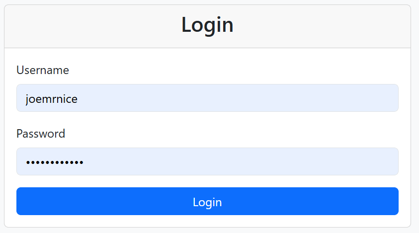
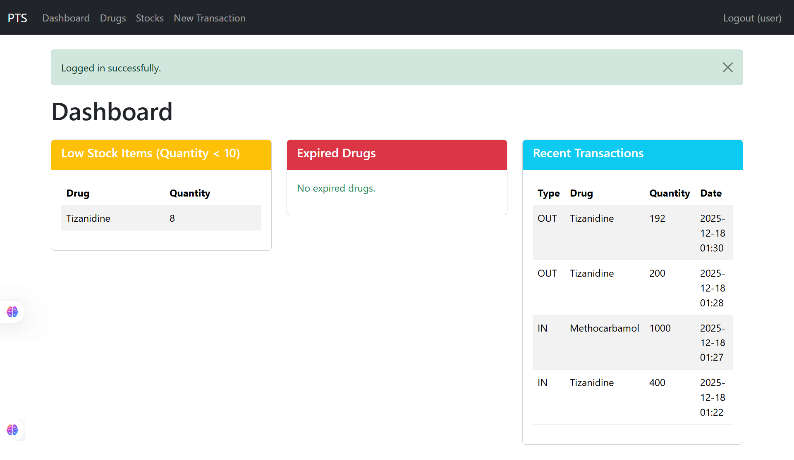
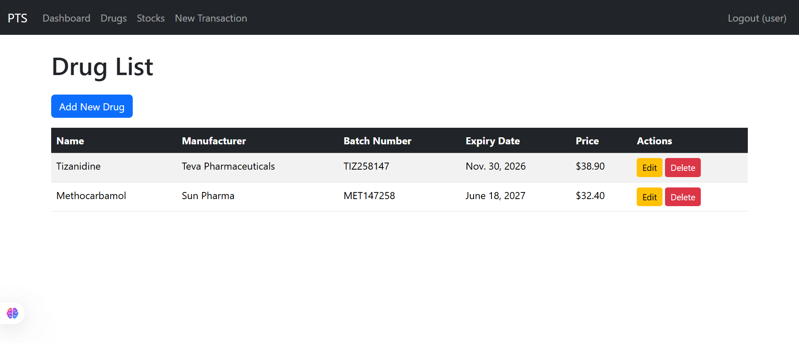
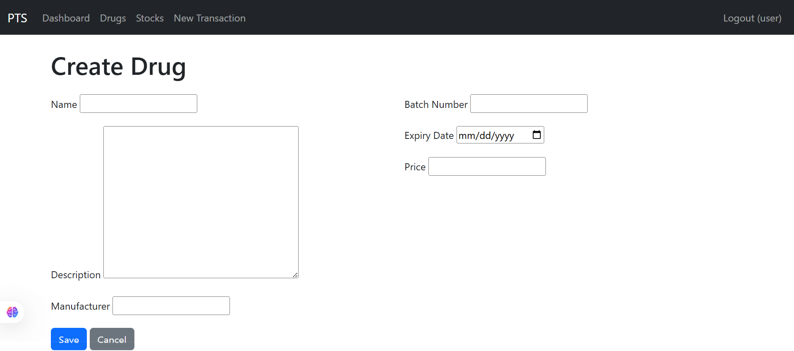

# Pharmaceutical Tracking System


## Overview

The Pharmaceutical Tracking System (PTS) is a web-based application designed to manage pharmaceutical inventories efficiently. It allows users to register drugs, track stock levels through transactions (in/out), and generate reports on low stock, expired drugs, and transaction history. Built with Django, it supports role-based access: Admins handle full CRUD operations on drugs, while Staff can perform transactions and view reports.

This project was developed as part of a college assignment for the Faculty of Information & Communications Technology at Limkokwing University of Creative Technology, Sierra Leone. It addresses real-world challenges in pharmaceutical supply chain management, such as inventory accuracy, expiry tracking, and regulatory compliance.

## Features

- **User Authentication**: Secure login/logout with role-based access (Admin and Staff).
- **Drug Management**: CRUD operations for drugs (name, description, manufacturer, batch number, expiry date, price) with validations (e.g., expiry in future, positive price).
- **Stock Tracking**: Automatic stock updates via transactions; view current stock levels.
- **Transactions**: Record incoming/outgoing stock movements, with insufficient stock validation.
- **Reporting**: Dashboard displays low stock (<10 units), expired drugs, and recent transactions.
- **Responsive UI**: Styled with Bootstrap 5 for a modern, mobile-friendly interface.
- **Error Handling**: Graceful validation and messages for user inputs.
- **Database**: Uses SQLite by default (easy to switch to PostgreSQL or others).

## Technologies Used

- **Backend**: Python 3.12+, Django 5.0+
- **Frontend**: HTML5, Bootstrap 5 (via CDN)
- **Database**: SQLite (default)
- **Other**: Django's built-in auth system, forms, and ORM

## Installation

### Prerequisites

- Python 3.12 or higher
- Git (for cloning the repository)

### Steps

1. **Clone the repository**:
   ```bash
   git clone https://github.com/joemrnice/pharma_track.git
   cd pharma_track
   ```

2. **Create and activate a virtual environment**:
   ```bash
   python -m venv venv
   source venv/bin/activate  # On Windows: venv\Scripts\activate
   ```

3. **Install dependencies**:
   ```bash
   pip install django==5.0
   ```

4. **Apply migrations**:
   ```bash
   python manage.py makemigrations pts
   python manage.py migrate
   ```

5. **Create an admin superuser**:
   ```bash
   python manage.py createsuperuser
   ```
   (Optional) Create staff users via the admin panel (`/admin/`) after starting the server.

6. **Run the development server**:
   ```bash
   python manage.py runserver
   ```
   Access the app at `http://127.0.0.1:8000/`.

For production, configure a proper web server (e.g., Gunicorn + Nginx), set `DEBUG=False`, and use a production database.

## Usage

- **Login**: Use the superuser credentials for admin access. Staff users (with `is_staff=True`) can log in but have limited permissions.
- **Dashboard**: View reports on low stock, expired drugs, and recent transactions.
- **Drugs**: Admins can add, edit, or delete drugs.
- **Stocks**: View current stock levels (auto-updated).
- **Transactions**: Staff/Admins can record in/out transactions, which update stock automatically.
- **Logout**: Available in the navbar.

## Screenshots

### Login Page:


### Dashboard:


### Drug List:


### Add Drug Form:


*(Add actual screenshot images to a `images/` folder in your repo and update the paths accordingly.)*

## Project Structure

```
pharma-track/
├── pharma_track/          # Main project directory
│   ├── settings.py
│   ├── urls.py
│   └── wsgi.py
├── pts/                   # App directory
│   ├── migrations/        # Database migrations
│   ├── templates/pts/     # HTML templates
│   │   ├── base.html
│   │   ├── dashboard.html
│   │   ├── drug_confirm_delete.html
│   │   ├── drug_form.html
│   │   ├── drug_list.html
│   │   ├── login.html
│   │   ├── stock_list.html
│   │   └── transaction_form.html
│   ├── forms.py
│   ├── models.py
│   ├── tests.py
│   ├── urls.py
│   └── views.py
├── manage.py
├── db.sqlite3             # Default database
├── README.md
└── requirements.txt       # (Generate with `pip freeze > requirements.txt`)
```

## Testing

Run unit tests:
```bash
python manage.py test pts
```

The tests cover model validations, transaction logic, and stock updates.

## Contributing

Contributions are welcome! Please follow these steps:

1. Fork the repository.
2. Create a new branch (`git checkout -b feature-branch`).
3. Commit your changes (`git commit -m 'Add new feature'`).
4. Push to the branch (`git push origin feature-branch`).
5. Open a Pull Request.

Ensure code follows PEP8 standards and includes tests for new features.

## License

This project is licensed under the MIT License. See the [LICENSE](LICENSE) file for details.

## Contact

For questions or suggestions, reach out via GitHub issues or email at [info@joestechs.com].

---

*Project developed on December 18, 2025.*
